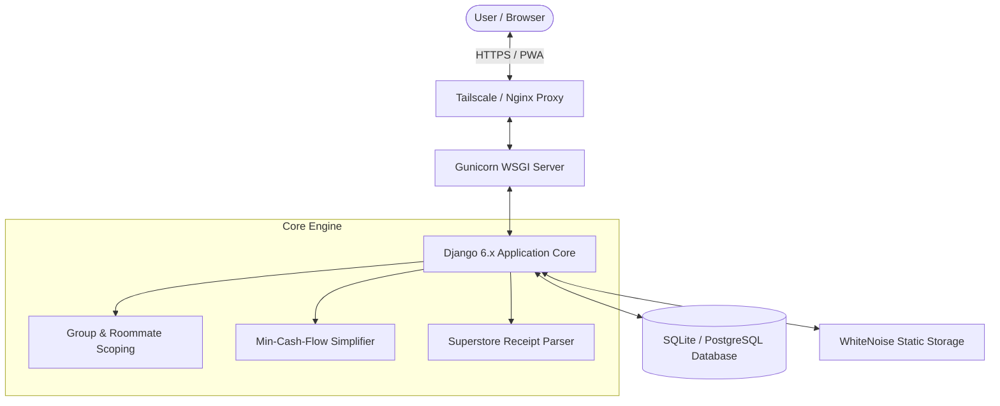

# 🏗️ Architecture & Technical Specification

The **Superstore Household Splitter** is engineered as a robust, lightweight, and modern Django web platform designed to solve multi-party expense sharing, automated grocery receipt parsing, and debt simplification with zero configuration.

---

## 🏛️ System Overview

---

## 🗄️ Core Data Models

### 1. `HouseholdGroup`
- **Scoping Entity**: Every expense, roommate, and receipt belongs to an isolated `HouseholdGroup`.
- **`created_by`**: Foreign key to `User`, representing the **Group Admin**.
- **`is_admin(user)`**: Helper returning `True` if `user == created_by` or if `user.is_superuser`.
- Group isolation ensures multi-tenant safety: users only see expenses and roommates for their active household.

### 2. `Roommate`
- Represents a spending participant within a household.
- Optionally linked 1-to-1 to a Django `auth.User`. If not yet registered, an unlinked placeholder allows tracking debts for roommates before they create accounts.

### 3. `Expense` & `ExpenseSplit`
- **`Expense`**: Header record storing total amount, paying roommate, description, notes, and group foreign key.
  - **Date Enforcement**: The `date` column is strictly assigned to `timezone.now().date()` server-side on creation. Users cannot forge past or future dates.
  - **`is_settlement`**: Boolean flag indicating whether the transaction is an equalization payment.
- **`ExpenseSplit`**: Child record storing each participant's individual owed portion, strictly summing to `Expense.amount`.

### 4. `Receipt`, `ReceiptItem`, `ReceiptAssignment`
- Models for digital grocery orders (Real Canadian Superstore / PC Express).
- Supports raw HTML storage, image extraction, tax and bottle deposit tracking, and item-by-item assignment among roommates.

---

## 🧮 Debt Simplification: Min-Cash-Flow Algorithm

In a household of $N$ roommates, bilateral debts can quickly scale to $O(N^2)$ transactions, causing confusion and endless bank transfers.

Our platform implements a greedy **Min-Cash-Flow** simplification algorithm:
1. **Compute Net Balance ($B_i$)**:
   $$\text{Net}_i = \sum \text{Paid by } i - \sum \text{Owed by } i$$
   Members with $\text{Net}_i > 0$ are net creditors; members with $\text{Net}_i < 0$ are net debtors.
2. **Greedy Matching**:
   - Repeatedly match the maximum debtor (owing the most) with the maximum creditor (owed the most).
   - Let transfer amount $M = \min(-\text{MaxDebtor}, \text{MaxCreditor})$.
   - Record payment: $\text{MaxDebtor} \xrightarrow{M} \text{MaxCreditor}$.
   - Update balances and repeat until all balances are $\approx \$0.00$.
3. **Properties**:
   - Reduces total transactions to at most $N - 1$.
   - Preserves mathematical exactness without altering any individual's net financial position.

---

## 🔍 Superstore Receipt Parsing & Reconciliation

The parser handles Real Canadian Superstore digital emails and invoices:
- **Regular Expression Scanning**: Extracts product descriptions, item codes, quantities, unit prices, and total item amounts.
- **Deposit & Tax Handling**: Identifies bottle deposits and GST/PST lines.
- **Reconciliation Engine**: Calculates discrepancy $\Delta = \text{Total Paid} - \sum \text{Itemized Prices}$. If bottle deposits or surcharges are separate line items, they are reconciled so that total split items equal the exact card transaction.

---

## 🛡️ Security & Multi-Tenancy

- **Role-Based Isolation**: Non-admin users cannot alter household membership, delete groups, or access receipts from groups they do not belong to.
- **CSRF & Session Protection**: All forms utilize Django's cryptographically signed CSRF tokens.
- **Zero-Data State Resilience**: All balance and summary queries handle edge cases where zero expenses or zero roommates exist, returning graceful empty states instead of 500 exceptions.
