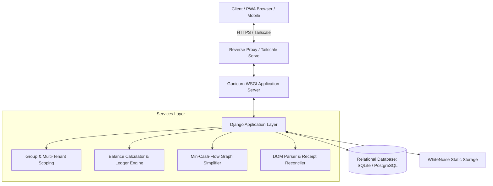
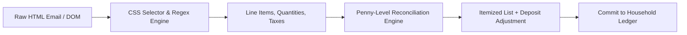

# SplitFlow Architecture and Technical Specification

This document provides the architectural specification for **SplitFlow**, covering database schemas, service layers, algorithmic debt simplification, receipt parsing reconciliation, and multi-tenant security boundaries.

---

## 1. System Overview

SplitFlow is structured as a decoupled web application served by an asynchronous WSGI server (Gunicorn) with static asset delivery handled through WhiteNoise:

---

## 2. Relational Data Models and Normalization

### 2.1. `HouseholdGroup`
- **Tenant Scope**: Establishes the tenancy boundary. All roommates, expenses, splits, and receipts are partitioned by `group_id`.
- **Attributes**:
  - `name`: Human-readable label (e.g., "Centennial Apartment", "Banff Roadtrip").
  - `slug`: URL-safe unique identifier.
  - `group_type`: Categorical identifier (`home`, `trip`, `other`).
  - `created_by`: Foreign key to `Roommate`, denoting the Group Admin.
  - `members`: Many-to-many relationship with `Roommate`.
- **Method `is_admin(user)`**: Returns `True` if `user.roommate == self.created_by` or if `user.is_superuser`.

### 2.2. `Roommate`
- **Participant Entity**: Represents a financial actor within groups.
- **Attributes**:
  - `user`: Nullable One-to-One key to Django `auth.User`. If null, represents a non-registered participant.
  - `name`: Display name.
  - `email`, `phone`: Contact channels.
  - `is_active`: Soft-deletion status flag.

### 2.3. `Expense` and `ExpenseSplit`
- **`Expense`**: Transaction header record.
  - `group`: Foreign key to `HouseholdGroup`.
  - `paid_by`: Foreign key to `Roommate` (the creditor).
  - `amount`: Transaction decimal amount ($> 0.00$).
  - `date`: Server-enforced date set strictly to `timezone.now().date()`.
  - `is_settlement`: Boolean flag denoting an equalization payment between two members.
  - `description`, `notes`, `category`: Metadata fields.
- **`ExpenseSplit`**: Itemized obligation record.
  - `expense`: Cascade foreign key to parent `Expense`.
  - `roommate`: Foreign key to `Roommate` (the debtor).
  - `amount`: Proportion of the expense owed by this participant.
  - **Constraint**: $\sum_{j} \text{ExpenseSplit}_{i,j}.\text{amount} = \text{Expense}_i.\text{amount}$.

### 2.4. `Receipt`, `ReceiptItem`, and `ReceiptAssignment`
- **`Receipt`**: Header for ingested Superstore digital orders. Stores raw HTML, order date, order totals, and tax amounts.
- **`ReceiptItem`**: Itemized row parsed from the receipt, including product title, quantity string, total price, and thumbnail URL.
- **`ReceiptAssignment`**: Allocation record linking an item to one or more roommates with fractional unit shares.

---

## 3. Debt Simplification: Greedy Min-Cash-Flow Algorithm

In a group of $N$ participants with bilateral transactions, the number of potential debt relationships is $O(N^2)$. To eliminate circular debts and minimize total bank transfers, SplitFlow applies a greedy Min-Cash-Flow reduction algorithm.

### 3.1. Mathematical Formulation

Let $P = \{1, 2, \dots, N\}$ be the set of participants. For each participant $i \in P$:

1. Compute Net Balance $\text{Net}_i$:
   $$\text{Net}_i = \sum_{e \in E, \text{paid\_by}(e)=i} \text{amount}(e) - \sum_{s \in S, \text{debtor}(s)=i} \text{amount}(s)$$

2. Partition participants into creditors and debtors:
   $$C = \{i \in P \mid \text{Net}_i > 0\}$$
   $$D = \{j \in P \mid \text{Net}_j < 0\}$$
   $$\text{Conservation Property: } \sum_{i \in C} \text{Net}_i + \sum_{j \in D} \text{Net}_j = 0$$

3. Greedy Iteration:
   - Identify maximum debtor $d^* = \arg\min_{j \in D}(\text{Net}_j)$ (owes the most).
   - Identify maximum creditor $c^* = \arg\max_{i \in C}(\text{Net}_i)$ (owed the most).
   - Determine transfer magnitude $T = \min(-\text{Net}_{d^*}, \text{Net}_{c^*})$.
   - Record directed transfer: $d^* \xrightarrow{T} c^*$.
   - Update balances:
     $$\text{Net}_{d^*} \leftarrow \text{Net}_{d^*} + T$$
     $$\text{Net}_{c^*} \leftarrow \text{Net}_{c^*} - T$$
   - Remove participants whose net balance reaches zero.
   - Terminate when all balances reach zero.

### 3.2. Complexity and Guarantees
- **Time Complexity**: $O(N \log N)$ using priority queues, or $O(N^2)$ with sequential scans.
- **Transfer Bound**: Produces at most $N - 1$ transactions, guaranteeing minimal settlement friction without altering any member's net financial entitlement.

---

## 4. Superstore Receipt Parsing and Reconciliation Pipeline

Digital order confirmations from Real Canadian Superstore frequently present reconciliation challenges:
- Promotional multi-buy discounts applied at subtotal level.
- Environmental bottle deposits listed separately from beverage base prices.
- Variable sales tax rates (GST, PST, exempt grocery items).

### 4.1. Reconciliation Logic

1. Parse total card charge $R_{\text{total}}$ from order summary blocks.
2. Parse sales tax $R_{\text{tax}}$ from tax breakdown blocks.
3. Calculate sum of itemized product prices:
   $$S_{\text{items}} = \sum_{k} \text{item}_k.\text{price}$$
4. Calculate reconciliation delta:
   $$\Delta = R_{\text{total}} - (S_{\text{items}} + R_{\text{tax}})$$
5. If $\Delta > \$0.00$, generate a synthetic line item:
   $$\text{Name: "Bottle Deposit & Environmental Fees"}, \quad \text{Price: } \Delta$$
6. Guarantees:
   $$\sum \text{Item Prices} + \text{Taxes} = \text{Credit Card Statement Billed Amount}$$

---

## 5. Security Architecture and Multi-Tenancy

- **Group Scoping Enforcement**: All database queries executed in views filter by `group=active_group`, preventing cross-household data exposure.
- **Administrative Access Boundaries**: Modifying household rosters, updating settings, or deleting groups requires verification against `group.is_admin(request.user)`. Unauthorized requests receive a 403 response or permission alert.
- **CSRF Protection**: All state-modifying requests require cryptographically validated CSRF tokens.
- **Zero-Data Defensive Programming**: Aggregation pipelines handle empty querysets gracefully, avoiding division-by-zero or `KeyError` exceptions when zero expenses or zero roommates exist.
