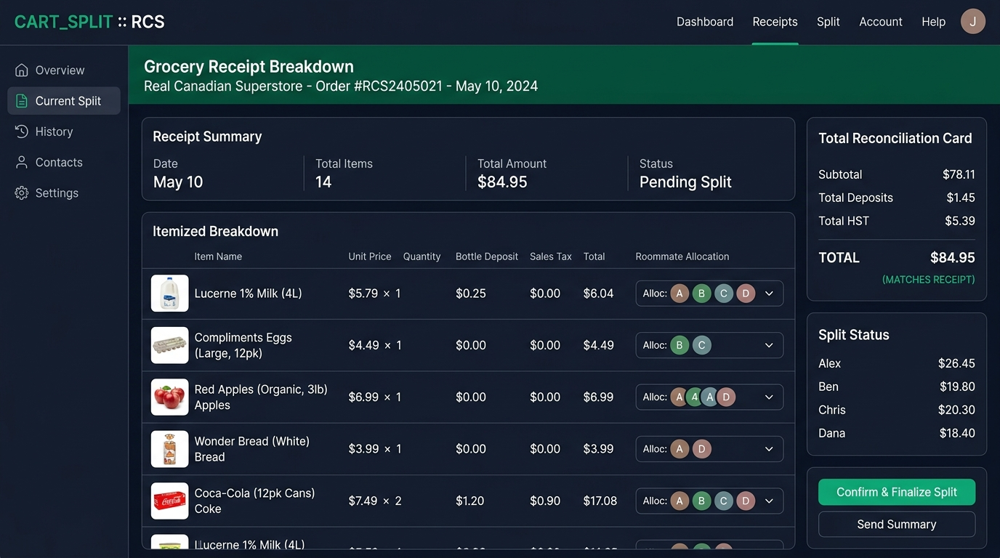

<div align="center">

  

# SplitFlow

### Next-Generation Open-Source Alternative to Splitwise with Advanced Automation & Superstore Itemization

[](https://www.djangoproject.com/)
[](https://www.python.org/)
[](https://tailwindcss.com/)
[](https://developer.mozilla.org/en-US/docs/Web/Progressive_web_apps)
[](https://opensource.org/licenses/MIT)
[-brightgreen?style=for-the-badge)](https://github.com/)

<p align="center">
  
</p>

</div>

---

## 💡 Why SplitFlow? The Open-Source Alternative to Splitwise

Frustrated by Splitwise's recent paywalls, daily expense caps, 10-second countdown delays, and invasive advertisements? 

**SplitFlow** was built as a modern, self-hostable, and completely free alternative that does everything Splitwise does — plus powerful features Splitwise never had:

| Feature | 🔴 Splitwise | 🟢 SplitFlow |
| :--- | :--- | :--- |
| **Pricing & Limits** | Limited to 3-4 expenses/day; invasive ads; paid "Splitwise Pro" paywall. | **100% Free & Open Source**. No limits, no paywalls, no artificial countdowns. |
| **Grocery Receipt Parsing** | Paid/manual receipt scanning; often hallucinates prices and requires manual typing. | **Automated Superstore / PC Express parser** with CDN image thumbnails, exact line items, and penny-perfect bottle deposit & tax reconciliation. |
| **Date Integrity & Tamper Proofing** | Users can change past dates arbitrarily, causing confusion and retroactive balance tampering. | **Server-Enforced Today's Date**. New expenses strictly lock to current date server-side (past context goes in Notes). |
| **Group Administration** | Flat permissions where any member can alter or break group settings. | **Group Admin Governance (👑)**. Group creator owns admin rights to manage rosters and settings. |
| **Splitwise Migration** | N/A | **1-Click Splitwise CSV Importer**. Seamlessly migrate your entire historical ledger and roommates in seconds. |
| **Data Privacy & Hosting** | Cloud-hosted; tracks spending data and surfaces targeted ads. | **Self-Hosted & Private**. Your financial data stays entirely on your own server or private Tailscale network. |
| **Debt Simplification** | Requires Pro subscription for certain algorithms. | **Built-in Greedy Min-Cash-Flow Simplifier** optimizing multi-party circular balances. |
| **Progressive Web App (PWA)** | Web wrapper prompting for native app store downloads. | **First-class PWA**. Installable on iOS, Android, and Desktop with offline asset caching. |

---

## 🌟 Core Features

- **⚡ Zero-Data Onboarding**: When a brand new user registers with no prior data, SplitFlow automatically provisions their initial household (`"<Name>'s Household"`), crowns them as Group Admin, and provides an immediate `$0.00` settled state without crashes or empty-database exceptions.
- **👑 Group Admin Role-Based Control**: The creator of a household or group is designated the **Group Admin**. Admins have exclusive authority to rename households, add registered users, invite new roommates, or remove members (the Admin cannot remove themselves).
- **🔒 Immutable Current Date Locking**: To protect chronological ledger integrity and stop backdated expense tampering, all new expenses are strictly locked to **Today's Date** on the server. Extra event context can be entered in the dedicated Notes section.
- **🧮 Min-Cash-Flow Debt Simplifier**: An optimized greedy graph algorithm transforms tangled circular debts into the minimum number of direct peer-to-peer payments.
- **🧾 Automated Superstore Receipt Ingestion**: Digital receipt scraper engineered for Real Canadian Superstore orders:
  - Extracts accurate item names, package quantities, and unit pricing.
  - Automatically fetches CDN grocery product thumbnails.
  - Reconciles environmental fees, bottle deposits, and GST/PST so item totals match card statements to the exact cent.
  - 1-click batch item assignment or even multi-roommate splits.
- **📥 Splitwise CSV Import**: Drag and drop any Splitwise group export CSV to instantly populate historical expenses, roommates, and balances.
- **📊 Real-time Visual Analytics**: Clean spending breakdown graphs, category distribution metrics, and roommate balance matrices powered by Chart.js.
- **📱 PWA & Tailscale HTTPS Ready**: Access seamlessly from home or on mobile across encrypted Tailscale networks (`ts.net:8443`) with standalone app installation support.

---

## 🖼️ Automated Superstore Receipt Itemizer

<div align="center">
  
</div>

SplitFlow solves the hardest part of shared apartment living: **itemizing massive grocery receipts**.
- Reads digital receipts and HTML emails directly.
- Handles multi-buy discounts, weighted produce, and bottle deposits.
- Allocates items directly to specific roommates or splits shared pantry items evenly.
- Exports LaTeX / PDF bill summaries for clean records.

---

## 🚀 Quick Start Guide

### Option 1: Local Development

```bash
# 1. Clone repository
git clone https://github.com/D-ENCODER/SplitFlow-Superstore.git
cd SplitFlow-Superstore

# 2. Check out development branch
git checkout dev

# 3. Setup virtual environment
python3 -m venv .venv
source .venv/bin/activate
pip install -r requirements.txt

# 4. Migrate database & collect static assets
python manage.py migrate
python manage.py collectstatic --noinput

# 5. Run automated test suite
python manage.py test rcsscrapper

# 6. Start development server
python manage.py runserver 0.0.0.0:8000
```

### Option 2: Docker Compose

```bash
# Launch containerized web server
docker compose up -d --build

# Run initial migrations and static collection
docker compose exec web python manage.py migrate
docker compose exec web python manage.py collectstatic --noinput
```

Open [http://localhost:8000](http://localhost:8000) or your configured domain!

---

## 📚 Technical Documentation & Wiki

Explore detailed specifications in the [`docs/`](docs/) directory:

| Document | Content |
| :--- | :--- |
| [**📖 User Guide**](docs/USER_GUIDE.md) | Complete manual covering account setup, Group Admin controls, expense entry, debt settlement, and PWA installation. |
| [**🏗️ Architecture Spec**](docs/ARCHITECTURE.md) | Technical architecture, data models, Min-Cash-Flow graph algorithm, and receipt reconciliation mathematics. |
| [**🚀 Deployment Guide**](docs/DEPLOYMENT.md) | Production setup with Docker, Linux Systemd, Gunicorn, Nginx, and Tailscale HTTPS. |

---

## 🌿 Branching Strategy

This repository enforces a structured Git workflow:

- **`main`**: Production release branch. Tested, verified, and ready for deployment.
- **`dev`**: Active development and integration branch for feature additions and tests.

```
       (Feature / Test)
         /---------\
dev ----*-----------*-----> (Active Development)
                     \
main -----------------*---> (Production Deployment)
```

---

## 🧪 Comprehensive Stress Testing

The platform includes an automated unit and stress testing suite verifying zero-data resilience, algorithm scaling, and permission controls:

```bash
python manage.py test rcsscrapper
```

- **`OpenSourceNewUserZeroDataTestCase`**: Registration, automated household group creation, clean zero-data state, server-side date enforcement.
- **`GroupAdminPermissionsTestCase`**: Group Admin permissions, member add/remove, intrusion rejection, owner self-removal protection.
- **`SplitwiseAlgorithmAndStressTestCase`**: Multi-party cyclical debt simplification, matrix conservation, and high-volume 12-member/100-split stress performance in < 1.5s.
- **`SuperstoreParserAndReconciliationTestCase`**: HTML itemization, bottle deposit reconciliation ($83.20 order verification), and 404-free graceful deletion.

---

## 📄 License

Distributed under the **MIT License**. See [`LICENSE`](LICENSE) for terms.
