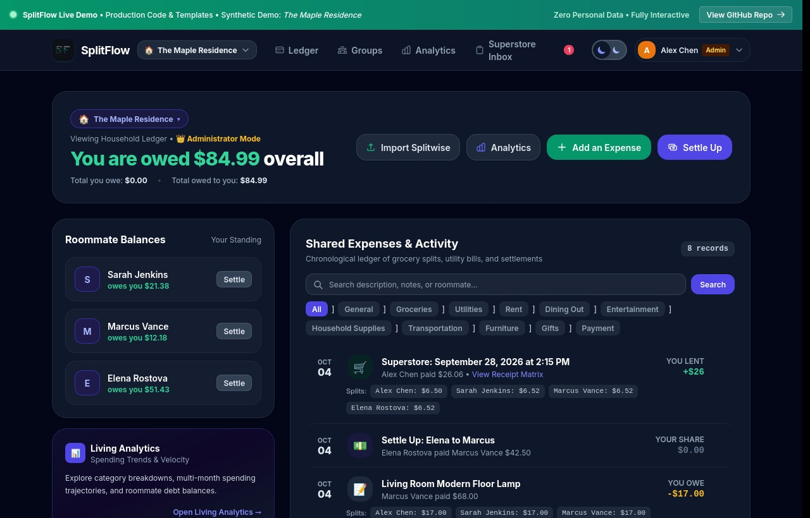

<div align="center">


# SplitFlow

**Production-Grade Multi-Tenant Household Expense Ledger, Debt Simplification Engine, and Automated Superstore Grocery Itemizer**

[](https://www.djangoproject.com/)
[](https://www.python.org/)
[](https://tailwindcss.com/)
[](https://developer.mozilla.org/en-US/docs/Web/Progressive_web_apps)
[](https://opensource.org/licenses/MIT)
[-brightgreen?style=flat-square)](https://github.com/D-ENCODER/SplitFlow)

<p align="center">
  
</p>

</div>

---

## 1. Executive Summary

SplitFlow is a self-hostable, multi-tenant financial application designed for households, roommates, travel groups, and shared living situations. It addresses the growing limitations of commercial platforms like Splitwise by providing an open-source, private, and mathematically verified platform free of paywalls, subscription fees, advertising, and rate limits.

In addition to traditional bill splitting and peer-to-peer equalizations, SplitFlow incorporates specialized ingestion capabilities for digital grocery receipts (Real Canadian Superstore / PC Express), automatically reconciling individual line items, weighted produce, multi-pack promotional pricing, sales taxes, and environmental bottle deposits.

---

## 2. Comparative Analysis: SplitFlow vs. Splitwise

| Evaluation Dimension | Splitwise (Free Tier) | SplitFlow (Open Source) |
| :--- | :--- | :--- |
| **Monetization & Limits** | Capped at 3 to 4 transactions daily; mandatory 10-second countdown delays; banner advertisements. | Unrestricted transactions, unlimited groups, zero paywalls, zero ads. |
| **Grocery Bill Processing** | Basic OCR with error-prone totals; no automated multi-roommate grocery allocation. | Automated HTML/DOM parser for Superstore orders; itemizes line items, quantities, CDN images, and bottle deposit fees. |
| **Temporal Integrity** | Backdating permitted by all users without audit trail; prone to retroactive tampering. | Strict server-side timestamping. All new expenses lock to the current calendar date; historical context belongs in notes. |
| **Governance & Security** | Flat permission model across group participants. | Group Admin role-based access control (RBAC). Only group creators manage membership and group parameters. |
| **Data Privacy** | Cloud-hosted multi-tenant infrastructure subject to third-party data collection and analytics. | Self-hosted. Supports local SQLite/PostgreSQL, Docker containers, and end-to-end encrypted Tailscale private networks. |
| **Simplification Engine** | Advanced simplification locked behind Splitwise Pro subscription. | Integrated greedy Min-Cash-Flow graph algorithm simplifying cyclic balances to minimal transactions. |
| **Migration** | Export only. | Native 1-click Splitwise CSV ingestion engine with automated duplicate filtering and currency validation. |

---

## 3. High-Level Architecture

The platform is structured as a decoupled Django monolith running behind an asynchronous WSGI server (Gunicorn) with static asset offloading managed by WhiteNoise:

```
[ Client / PWA Browser / Mobile ]
               │
               ▼  (HTTPS / Tailscale)
     [ Reverse Proxy / Nginx ]
               │
               ▼  (Port 8000)
    [ Gunicorn WSGI Worker Pool ]
               │
   ┌───────────┴───────────┐
   │    Django Application │
   ├───────────────────────┤
   │  - Auth & RBAC        │
   │  - Scoped Context     │
   │  - Min-Cash-Flow Alg. │
   │  - Superstore Parser  │
   └───────────┬───────────┘
               │
      [ SQLite / PostgreSQL ]
```

---

## 4. Comprehensive Function & Technical Reference

### 4.1. Core Service Layer (`rcsscrapper/services.py`)

- **`calculate_balances(current_roommate, group)`**
  Computes complete debt matrices for an active group. Iterates over active expenses and splits, calculates net credits and debits per member, and runs the result through `simplify_debts`. Returns a structured dictionary containing `net_matrix`, `user_summary` (`total_net`, `total_owed_to_user`, `total_user_owes`, `friend_balances`), `all_roommates`, and active `expenses`.
- **`simplify_debts(net_balances, roommates)`**
  Executes a greedy Min-Cash-Flow optimization algorithm on raw member balances. Identifies maximum debtor and maximum creditor, settles the minimum of their respective balances, and updates the state iteratively. Reduces worst-case $O(N^2)$ circular debts down to at most $N - 1$ direct transactions.
- **`import_and_clean_splitwise_csv(file_obj, target_group)`**
  Robust importer for Splitwise CSV export files. Parses metadata headers, extracts currency and member columns, creates or associates `Roommate` models, creates `Expense` headers, and populates `ExpenseSplit` records while ignoring balance adjustment rows.
- **`resolve_roommate_for_name(raw_name, target_group)`**
  Fuzzy-matching entity resolution service. Normalizes display names, removes deleted user flags, and maps incoming transaction names to existing members before falling back to new profile generation.

### 4.2. Ingestion & Utility Layer (`rcsscrapper/utils.py`)

- **`extract_items_from_soup(soup)`**
  Parses BeautifulSoup DOM structures of Real Canadian Superstore digital orders. Resolves product titles, numeric/weighted quantities, unit prices, and high-resolution CDN images. Detects billing differentials and generates explicit line items for bottle deposits and environmental recycling surcharges.
- **`parse_tax_from_soup(soup)`**
  Locates and extracts GST, PST, and HST figures using targeted CSS selectors and regex pattern matching (`\$\s*(\d+\.\d{2})`).
- **`parse_order_total_from_soup(soup)`**
  Executes multi-selector fallback scans against order summary wrappers to determine the exact total billed to the payment card.
- **`sync_receipts_folder(force_refresh=False)`**
  File system synchronization agent scanning `rcsscrapper/receipts_inbox/` for `.html` files, checking modification timestamps, and synchronizing parsed order records with the database.

### 4.3. View Controller Layer (`rcsscrapper/views.py`)

#### Authentication & Profile
- **`login_view(request)`**: Validates user credentials with support for username and email matching.
- **`register_view(request)`**: Registers new users, auto-provisions their initial primary household, and designates them as Group Admin.
- **`logout_view(request)`**: Flushes user session and redirects to login.
- **`profile_view(request)`**: Manages user details, avatar initials, password modifications, and linked roommate profile bindings.

#### Expense Management & Dashboard
- **`splitwise_dashboard(request)`**: Primary operational ledger displaying net balance pills, friend balances, and chronological expense cards.
- **`add_expense(request)`**: Validates expense submissions. Enforces server-side date assignment to `timezone.now().date()`, verifies equal or custom multi-member allocations, and inserts `Expense` and `ExpenseSplit` records.
- **`settle_up(request)`**: Records equalizing settlement payments between pairs of roommates.
- **`delete_expense(request, expense_id)`**: Deletes an existing expense record with cascade deletion of related splits.

#### Group Governance & Administration
- **`group_list(request)`**: Lists all active households, annotating each group with administrative privileges (`can_manage`, `is_owner`, `admin_name`).
- **`create_group(request)`**: Creates a new `HouseholdGroup` and binds the authenticated user as creator and Group Admin.
- **`select_group(request, group_id)`**: Switches the active group context in the session.
- **`manage_group(request, group_id)`**: Dedicated Group Admin interface allowing group renaming, member addition (existing user search or manual creation), member removal (creator cannot self-remove), and group deletion.
- **`import_splitwise(request)`**: Handles Splitwise CSV uploads and triggers `import_and_clean_splitwise_csv`.

#### Superstore Order Processing
- **`receipt_list(request)`**: Lists pending and processed grocery receipts (restricted to staff/admin).
- **`batch_process(request)`**: Step-by-step interactive interface for assigning individual receipt items to roommates.
- **`batch_summary(request)`**: Displays calculated shares, itemizations, and tax distributions prior to committing to the ledger.
- **`export_latex_pdf(request)`**: Compiles formal receipt accounting summaries to PDF format via LaTeX templates.
- **`api_ingest_order(request)`**: REST API endpoint accepting JSON payloads or raw HTML streams for automated receipt delivery via webhooks.
- **`analytics_dashboard(request)`**: Renders monthly spending trends, category distributions, and member balance charts.
- **`toggle_archive_receipt(request, receipt_id)`**: Toggles archive status for a receipt.
- **`delete_receipt(request, receipt_id)`**: Safely removes receipt records and associated item rows without 404 errors on missing entities.

### 4.4. Global Context Processor (`rcsscrapper/context_processors.py`)

- **`get_active_group(request)`**: Determines the currently active household by inspecting session storage, authenticated user memberships, or fallback groups.
- **`splitflow_context(request)`**: Injects global navigational state into all template renders:
  - `nav_active_group`: Currently selected `HouseholdGroup` instance.
  - `nav_all_groups`: Full list of groups accessible to the user.
  - `nav_active_roommates`: Active roommate participants in the active group.
  - `nav_current_roommate`: Authenticated user's linked `Roommate` record.
  - `nav_is_admin`: Superuser or system staff indicator.
  - `nav_is_group_admin`: Boolean flag indicating if user owns the active group.
  - `nav_pending_receipts_count`: Badge count of unassigned Superstore orders.
  - `today`: Canonical current server date.

---

## 5. Data Model Schema (`rcsscrapper/models.py`)

```
┌──────────────────┐            ┌──────────────────┐
│  HouseholdGroup  │◄───M:N────►│     Roommate     │
├──────────────────┤            ├──────────────────┤
│ id (PK)          │            │ id (PK)          │
│ name             │            │ user_id (FK-1:1) │
│ slug             │            │ name             │
│ group_type       │            │ email, phone     │
│ created_by (FK)  │            │ is_active        │
└────────┬─────────┘            └────────┬─────────┘
         │                               │
         │ 1:N                           │ 1:N
         ▼                               ▼
┌──────────────────┐            ┌──────────────────┐
│     Expense      │◄───1:N────►│   ExpenseSplit   │
├──────────────────┤            ├──────────────────┤
│ id (PK)          │            │ id (PK)          │
│ group_id (FK)    │            │ expense_id (FK)  │
│ paid_by_id (FK)  │            │ roommate_id (FK) │
│ amount, date     │            │ amount           │
│ is_settlement    │            └──────────────────┘
└──────────────────┘
```

- **`HouseholdGroup`**: Multi-tenant isolation boundary. Every transaction, member link, and receipt is scoped to a group. Provides `is_admin(user)` checking if a user matches `created_by` or possesses superuser privileges.
- **`Roommate`**: Financial participant profile. Can be linked to a Django `User` account or maintained as an unlinked profile for roommates who have not yet registered.
- **`Expense`**: Transaction header. The `date` attribute is strictly assigned to `timezone.now().date()` upon insertion.
- **`ExpenseSplit`**: Itemized owed share. The sum of all splits for an expense must equal `Expense.amount`.
- **`Receipt`**, **`ReceiptItem`**, **`ReceiptAssignment`**: Ingestion records for digital grocery invoices, capturing item names, units, package prices, taxes, and participant shares.

---

## 6. Installation & Deployment

### Local Development Setup

```bash
# Clone the repository
git clone https://github.com/D-ENCODER/SplitFlow.git
cd SplitFlow

# Check out development branch
git checkout dev

# Create virtual environment and install dependencies
python3 -m venv .venv
source .venv/bin/activate
pip install -r requirements.txt

# Run migrations and collect static assets
python manage.py migrate
python manage.py collectstatic --noinput

# Run the automated test suite
python manage.py test rcsscrapper

# Start local development server
python manage.py runserver 0.0.0.0:8000
```

### Production Docker Compose Setup

```bash
# Build and start background containers
docker compose up -d --build

# Run database migrations
docker compose exec web python manage.py migrate

# Collect static assets
docker compose exec web python manage.py collectstatic --noinput
```

---

## 7. Testing & Verification

SplitFlow maintains an automated test suite covering zero-data onboarding, role-based access control, stress testing, and HTML DOM reconciliation:

```bash
python manage.py test rcsscrapper
```

### Test Case Overview:
1. `OpenSourceNewUserZeroDataTestCase.test_new_user_registration_and_auto_group_creation`: Validates registration of a new user, automatic creation of their initial household, and assignment as Group Admin.
2. `OpenSourceNewUserZeroDataTestCase.test_zero_data_dashboard_renders_cleanly`: Confirms that a newly registered user with zero expenses or roommates renders a clean `$0.00` settled state without throwing exceptions.
3. `OpenSourceNewUserZeroDataTestCase.test_expense_date_enforced_to_today`: Verifies that POST requests attempting to submit past dates are overridden server-side to `today`.
4. `GroupAdminPermissionsTestCase.test_owner_can_add_member`: Confirms Group Admins can add new members.
5. `GroupAdminPermissionsTestCase.test_intruder_cannot_modify_group`: Verifies non-admins are blocked from editing or deleting groups.
6. `GroupAdminPermissionsTestCase.test_owner_cannot_remove_self`: Prevents group abandonment by blocking Group Admins from removing themselves.
7. `SplitwiseAlgorithmAndStressTestCase.test_pairwise_debt_simplification_cycle`: Evaluates multi-party debt cycles (A owes B, B owes C, C owes A) and confirms complete graph resolution.
8. `SplitwiseAlgorithmAndStressTestCase.test_multi_party_split_integrity`: Tests custom and equal splits across multiple members.
9. `SplitwiseAlgorithmAndStressTestCase.test_large_scale_stress_simplification`: Stress-tests 12 roommates across 100 multi-split expenses, verifying balance matrix conservation (`sum == 0`) and execution time under 1.5 seconds.
10. `SuperstoreParserAndReconciliationTestCase.test_extract_items_and_reconcile_total`: Verifies product itemization, unit parsing, and reconciliation of bottle deposit differentials against known receipt totals.
11. `SuperstoreParserAndReconciliationTestCase.test_delete_receipt_endpoint_graceful_missing`: Tests idempotent receipt deletion without generating 404 responses.

---

## 8. Branching & Contribution Workflow

This project adheres to a standard release branching model:

- **`main`**: Stable, tested code ready for production deployment.
- **`dev`**: Active development branch where new features, bug fixes, and tests are integrated.

---

## 9. License

This project is licensed under the **MIT License**. Refer to the [LICENSE](LICENSE) file for complete terms.
